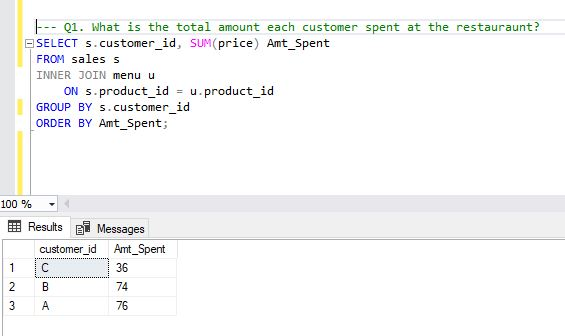

# Danny Ma's SQL-CHALLENGE

## Introduction
#### Danny's Dinner is a restraunt that is in need of a data analyst to help make informed business decisions to keep the new restraunt afloat.

## Problem Statement 
#### Danny wants to use the data to answer a few simple questions about his customers, especially about their visiting patterns, how much money they’ve spent and also which menu items are their favourite. Having this deeper connection with his customers will help him deliver a better and more personalised experience for his loyal customers.
He plans on using these insights to help him decide whether he should expand the existing customer loyalty program.
**_Note_** : _The datasets provided by client are;
1. sales
2. menu
3. members

## Challenge Encountered
There was a ready-to-work query editor to use as part of the sql challenge. However, I encountered a lot of problems with using that online editor. I decided to use SQL Server Management Studio. The database wasn't readily available on SQL server so a Danny Ma database was created in SQL Server before proceeding with the case study questions. 
A snippet of it is shown in the diagram below; however, the script file is in this repository.

## Case Study Questions and Solutions
#### Q1. What is the total amount each customer spent at the restraunt?
To answer this question, I joined the sales and menu table since the information we need is found in these two tables.

The query above selects customer_id from sales column aliased as s, it then looks for the product that was bought also from sales and gets the price of that product from the menu column aliased as u. It then groups all products bought by customer and gives the total sum. 

Q2. How many days has each customer visited the restraunt?
All data needed to answer this question is in the sales column. 

The query selects customer_id groups it, and then counts the distinct number of days each customer viisted.

Q3. What was the first item from the menu purchased by each customer?
The data needed to answer this question is in two tables; sales and menu hence, we join them.

The above query selects customer_id and product name from the joined tables where the order date is the earliest(minimum) order date.

Q4. What is the most purchased item on the menu, how many times was it purchased by all customers?
Here, we join 2 tables; sales and menu using the product_id.

The query above groups the product name and counts the number of times a customer has purchased the product. It then orders the products based on the number of times it has been purchased in descending order. The "top 1" at the beginning of the query selects only the first product on the list, in this case, the highest purchased.

Q5. Which item was the most popular for each customer?
Again, the data needed here is in two tables; sales and menu hence, we join them. We also used a subquery here.

Lets's start with the inner query(subquery). It joins the two tables we will need our data from. It then selects customer_id, product name and counts the number of times that product has been purchased and stores it as the number of orders.  
The main query selects customer_id, product_name and the maximum number of orders from the results of the subquery. 

Q6. Which item was purchased first by the customer after they became a member?
Here, we created a temporary table called purchase table and joined the original 3 tables; sales, menu and members.

